# Website Đặt Đồ Ăn Cicafood

## Giới thiệu

**Cicafood** là một website đặt đồ ăn trực tuyến được xây dựng trên nền tảng **WordPress** kết hợp plugin tùy chỉnh **Cicafood Core**. Hệ thống cho phép khách hàng duyệt nhà hàng, đặt món ăn, quản lý đơn hàng và sử dụng voucher giảm giá. Đồng thời, chủ nhà hàng (Merchant) có thể quản lý menu, đơn hàng và voucher thông qua giao diện quản trị riêng.

Dự án được thực hiện trong khuôn khổ môn học **Phần Mềm Mã Nguồn Mở** — Khoa Công nghệ Thông tin, Trường Đại học Điện Lực.

**Giảng viên hướng dẫn:** ThS. Cấn Đức Điệp

---

## Danh sách thành viên & Phân công nhiệm vụ

| STT | Họ và tên | MSSV | Vai trò | Nội dung thực hiện |
|:---:|---|:---:|---|---|
| 1 | **Nguyễn Trần Xuân Bắc** | 23810310100 | Trưởng nhóm / Backend | Cài đặt Database, WordPress. Phát triển plugin **cicafood-core** (toàn bộ logic backend, custom tables, shortcodes, routing, role,...). Deploy website từ localhost lên shared hosting Namecheap. |
| 2 | **Bùi Trung Dũng** | 23810310099 | Frontend | Thiết kế giao diện: Thanh toán, Lịch sử đơn hàng, Hồ sơ cá nhân, Nhà hàng yêu thích, Voucher, Merchant Dashboard. Nhập dữ liệu demo. |
| 3 | **Nguyễn Bá Tuấn Anh** | 23810310109 | Frontend | Xây dựng theme **cicafood** (Header, Footer, CSS). Thiết kế giao diện: Trang chủ, Danh sách nhà hàng, Chi tiết nhà hàng, Đăng nhập/Đăng ký. |

**Lớp:** D18CNPM2 &nbsp;|&nbsp; **Khóa:** 2023–2028

---

## Công nghệ sử dụng

| Thành phần | Công nghệ |
|---|---|
| **CMS** | WordPress |
| **Ngôn ngữ Backend** | PHP |
| **Cơ sở dữ liệu** | MySQL (phpMyAdmin) |
| **Web Server** | Apache (XAMPP) |
| **Theme** | Cicafood (child theme của Storefront — WooCommerce) |
| **Plugin chính** | Cicafood Core (tự phát triển), WooCommerce, Classic Editor, All-in-One WP Migration |
| **Frontend** | HTML5, CSS3, JavaScript (AJAX, Chart.js) |
| **Phân tích dữ liệu** | Python, JSON |
| **Hosting** | Namecheap (Shared Hosting + cPanel) |
| **Chứng chỉ SSL** | Có (HTTPS) |
| **Quản lý phiên bản** | Git, GitHub |

---

## Chức năng chính

### Dành cho Khách hàng
- Đăng ký / Đăng nhập tài khoản
- Xem danh sách nhà hàng theo danh mục
- Xem chi tiết nhà hàng và menu món ăn
- Thêm món vào giỏ hàng, đặt hàng
- Áp dụng voucher giảm giá khi thanh toán
- Xem lịch sử và chi tiết đơn hàng
- Đánh giá nhà hàng sau khi đặt hàng
- Lưu nhà hàng yêu thích
- Quản lý hồ sơ cá nhân

### Dành cho Chủ nhà hàng (Merchant)
- Dashboard quản lý tổng quan
- Quản lý menu món ăn (thêm/sửa/xóa)
- Quản lý đơn hàng (xác nhận, cập nhật trạng thái)
- Quản lý voucher riêng cho nhà hàng
- Cài đặt thông tin nhà hàng

### Dành cho Quản trị viên (Admin)
- Quản lý toàn bộ nhà hàng, danh mục, người dùng
- Quản lý voucher hệ thống
- Phân tích & thống kê dữ liệu
- Quản lý thông tin thanh toán QR

---

##  Link Website đã Deploy

 **Website chính thức:** [https://cicafood.online](https://cicafood.online)

--- 

## Hướng dẫn cài đặt

### Yêu cầu hệ thống
- **XAMPP** (Apache + MySQL + PHP 7.4+)
- Trình duyệt web (Chrome, Firefox, Edge,...)

### Các bước cài đặt

**Bước 1: Cài đặt XAMPP**
- Tải XAMPP tại: [https://www.apachefriends.org/](https://www.apachefriends.org/)
- Cài đặt và khởi động **Apache** + **MySQL** từ XAMPP Control Panel.

**Bước 2: Clone repository**
```bash
cd C:\xampp\htdocs
git clone <link-repo-github> wpcicafood
```

**Bước 3: Tạo cơ sở dữ liệu**
- Truy cập phpMyAdmin tại: `http://localhost/phpmyadmin`
- Tạo database mới với tên: `cicafood_wp`
- Encoding: `utf8mb4_unicode_ci`

**Bước 4: Cấu hình WordPress**
- Mở file `wp-config.php` và kiểm tra các thông số:
```php
define('DB_NAME', 'cicafood_wp');
define('DB_USER', 'root');
define('DB_PASSWORD', '');
define('DB_HOST', 'localhost');
```

**Bước 5: Import dữ liệu**
- **Cách 1 (Thủ công):** Vào phpMyAdmin → Chọn database `cicafood_wp` → Tab **Import** → Chọn file `cicafood_wp.sql` → Nhấn **Go**.
- **Cách 2 (All-in-One WP Migration):** Truy cập `http://localhost/wpcicafood/wp-admin` → Cài plugin **All-in-One WP Migration** → Vào **All-in-One WP Migration → Import** → Chọn file `localhost-wpcicafood-backup.wpress`. (Tải file backup tại: https://drive.google.com/file/d/1BvgPsPh7gLi1RWZ-35F92cBNt38tAR5V/view?usp=drive_link).


**Bước 6: Kích hoạt Plugin**
- Truy cập `http://localhost/wpcicafood/wp-admin`
- Vào **Plugins** → Kích hoạt **Cicafood Core** và **WooCommerce**
- Plugin Cicafood Core sẽ tự động tạo 10 custom tables và dữ liệu mẫu.

---

## Hướng dẫn chạy project

1. Mở **XAMPP Control Panel** → Start **Apache** và **MySQL**
2. Truy cập website tại: `http://localhost/wpcicafood`
3. Truy cập trang quản trị: `http://localhost/wpcicafood/wp-admin`

---

## Tài khoản demo

| Vai trò | Tên đăng nhập | Mật khẩu |
|---|---|---|
| Admin | `admin` | `NBTA22052005:))` |
| Merchant (Chủ nhà hàng) | `jvke0529` | `Bac25092005@` |
| Customer (Khách hàng) | `khach1` | `123456` |

---

## 📸 Hình ảnh minh họa hệ thống

### Quản trị hệ thống (Admin / Cicafood Core)

| # | Hình ảnh | Mô tả |
|:---:|---|---|
| 1 | 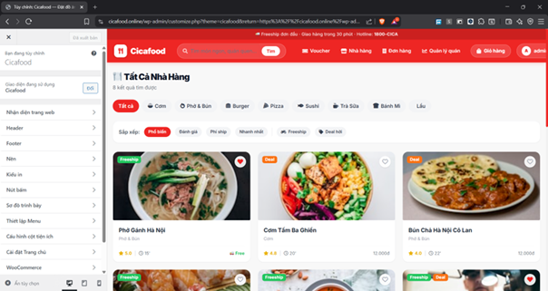 | Giao diện chỉnh sửa theme custom Cicafood |
| 2 | 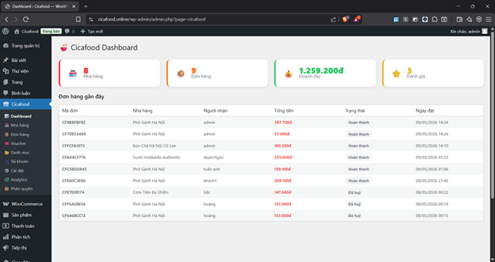 | Giao diện Dashboard trong Cicafood Core |
| 3 | 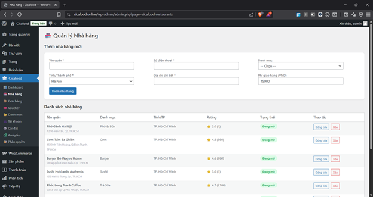 | Giao diện Quản lý nhà hàng trong Cicafood Core |
| 4 | 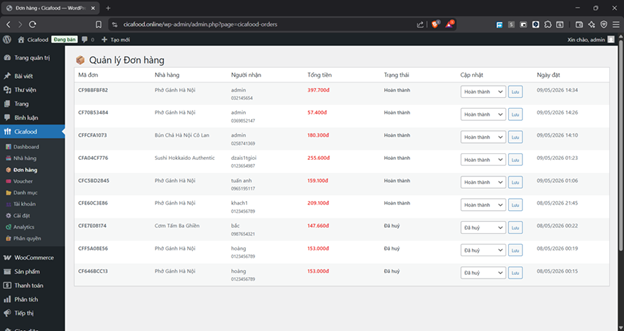 | Giao diện Quản lý đơn hàng trong Cicafood Core |
| 5 | 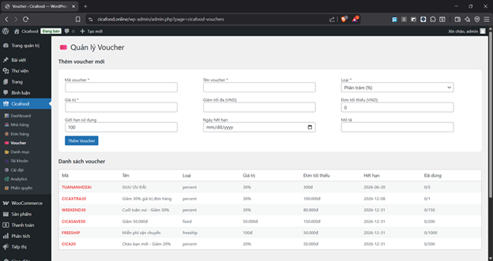 | Giao diện Quản lý Voucher trong Cicafood Core |
| 6 | 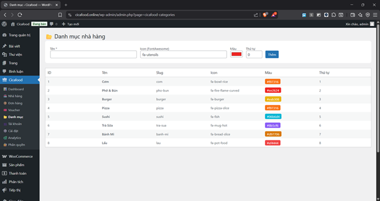 | Giao diện Danh mục trong Cicafood Core |
| 7 | 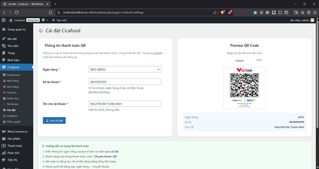 | Giao diện Thông tin thanh toán QR trong Cicafood Core |
| 8 | 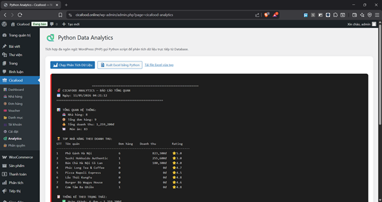 | Giao diện Phân tích & Thống kê dữ liệu trong Cicafood |

### Giao diện người dùng (Frontend)

| # | Hình ảnh | Mô tả |
|:---:|---|---|
| 9 | 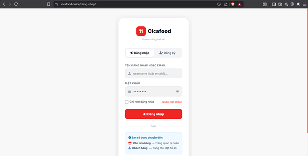 | Giao diện Đăng nhập |
| 10 |  | Giao diện Đăng ký |
| 11 | 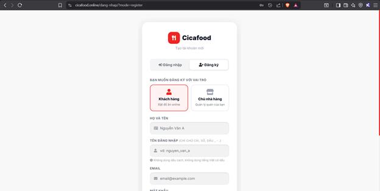 | Giao diện Dashboard |
| 12 | 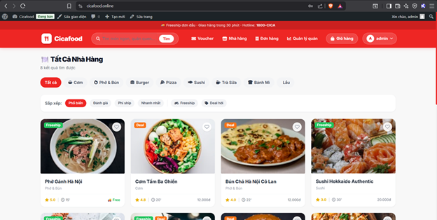 | Giao diện Trang chủ |
| 13 |  | Giao diện Nhà hàng |
| 14 |  | Giao diện Quản lý voucher |
| 15 | 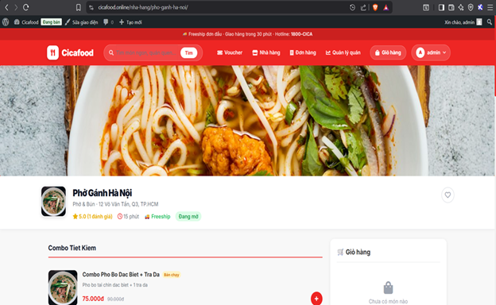 | Giao diện Quản lý đơn hàng cho khách hàng |
| 16 | 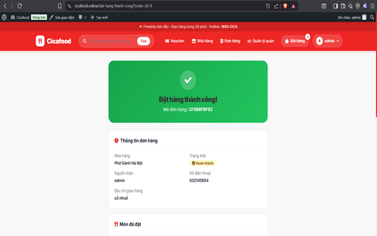 | Chi tiết đơn hàng |
| 17 |  | Giao diện Giỏ hàng |
| 18 |  | Giao diện Hồ sơ cá nhân |
| 19 |  | Giao diện Nhà hàng yêu thích |
| 20 | 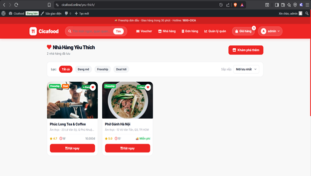 | Chức năng Quản lý menu |
| 21 | 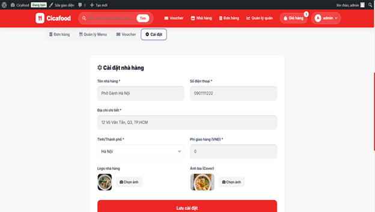 | Chức năng Thêm voucher |
| 22 |  | Chức năng Cài đặt nhà hàng |

---

## Video Demo

[](https://www.youtube.com/watch?v=6dcfDsn0eN4)

---

##  Cấu trúc thư mục dự án

### Plugin Cicafood Core

```
wp-content/plugins/cicafood-core/
├── cicafood-core.php              # File chính của plugin (activation, hooks, routing)
├── analytics.py                   # Script Python phân tích & thống kê dữ liệu
├── baocao_cicafood.xlsx           # Báo cáo dữ liệu xuất từ hệ thống
├── report_admin.xlsx              # Báo cáo quản trị
├── SETUP.md                       # Hướng dẫn cài đặt plugin
│
├── admin/
│   └── admin-menu.php             # Giao diện quản trị admin (Dashboard, CRUD)
│
├── includes/
│   ├── ajax-handlers.php          # Xử lý tất cả AJAX requests
│   ├── class-database.php         # Tạo & quản lý 10 custom tables
│   ├── class-cart.php             # Logic giỏ hàng (Session-based)
│   ├── class-menu.php             # Quản lý menu món ăn
│   ├── class-order.php            # Quản lý đơn hàng
│   ├── class-restaurant.php       # Quản lý nhà hàng
│   ├── class-review.php           # Quản lý đánh giá
│   ├── class-voucher.php          # Quản lý voucher
│   └── shortcodes.php             # Đăng ký 9 shortcodes
│
├── templates/                     # Template routing cho các trang
│   ├── auth-page.php              # Trang đăng nhập/đăng ký
│   ├── restaurant-single.php      # Trang chi tiết nhà hàng
│   ├── merchant-page.php          # Trang quản lý merchant
│   ├── favorites-page.php         # Trang yêu thích
│   ├── profile-page.php           # Trang hồ sơ
│   └── order-confirmation-page.php # Trang xác nhận đơn hàng
│
├── views/                         # Giao diện frontend (HTML + PHP + JS inline)
│   ├── home.php                   # Trang chủ
│   ├── restaurants.php            # Danh sách nhà hàng
│   ├── restaurant-detail.php      # Chi tiết nhà hàng & menu
│   ├── checkout.php               # Thanh toán
│   ├── order-history.php          # Lịch sử đơn hàng
│   ├── order-confirmation.php     # Xác nhận đơn hàng thành công
│   ├── profile.php                # Hồ sơ cá nhân
│   ├── favorites.php              # Nhà hàng yêu thích
│   ├── vouchers.php               # Danh sách voucher
│   ├── merchant-dashboard.php     # Dashboard chủ nhà hàng
│   ├── merchant-vouchers.php      # Quản lý voucher merchant
│   └── auth.php                   # Form đăng nhập / đăng ký
│
├── database/
│   ├── check_db.php               # Kiểm tra trạng thái database
│   ├── seed_all_menus.php         # Seed dữ liệu menu mẫu
│   └── seed_bun_cha.php           # Seed dữ liệu nhà hàng Bún Chả
│
└── assets/
    └── js/
        └── restaurant.js          # JavaScript xử lý trang nhà hàng
```

### Theme Cicafood (Child Theme của Storefront)

```
wp-content/themes/cicafood/
├── style.css                      # CSS chính (brand colors, overrides, utilities)
├── functions.php                  # Đăng ký scripts, styles, custom functions
├── header.php                     # Header tùy chỉnh (navbar, logo, menu)
├── footer.php                     # Footer tùy chỉnh
└── assets/
    └── js/
        └── main.js                # JavaScript chung (back-to-top, toast, animations)
```

### Custom Tables (10 bảng)
`wp_cica_categories`, `wp_cica_restaurants`, `wp_cica_menu_categories`, `wp_cica_menu_items`, `wp_cica_orders`, `wp_cica_order_items`, `wp_cica_vouchers`, `wp_cica_user_vouchers`, `wp_cica_reviews`, `wp_cica_favorites`

### Shortcodes
`[cicafood_home]`, `[cicafood_restaurants]`, `[cicafood_restaurant]`, `[cicafood_checkout]`, `[cicafood_orders]`, `[cicafood_profile]`, `[cicafood_vouchers]`, `[cicafood_favorites]`, `[cicafood_merchant_vouchers]`

---
